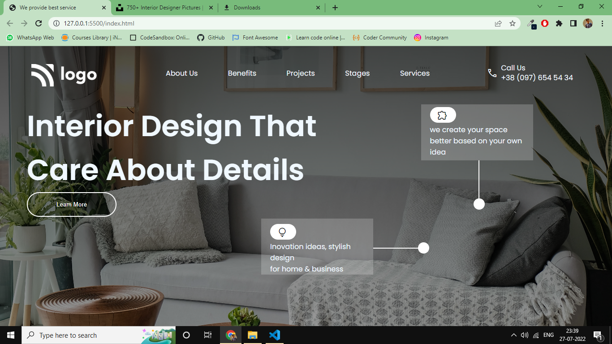

# 10 Project 

 > Project 10 [Live Link](https://interiordesign10.netlify.app/)

- >  Skills Gained in this project
    -   Learned to use `background-image` with `lienar-gradient`.

---

## Time taken to finish this project

-   2 hour taken to complete it.

### Screenshot

